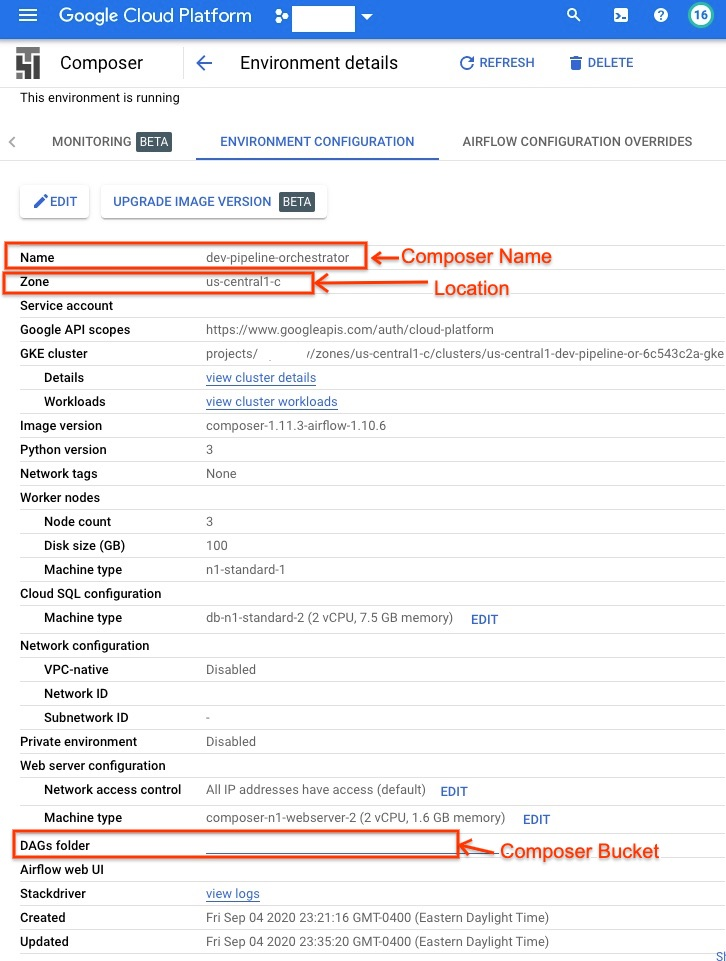
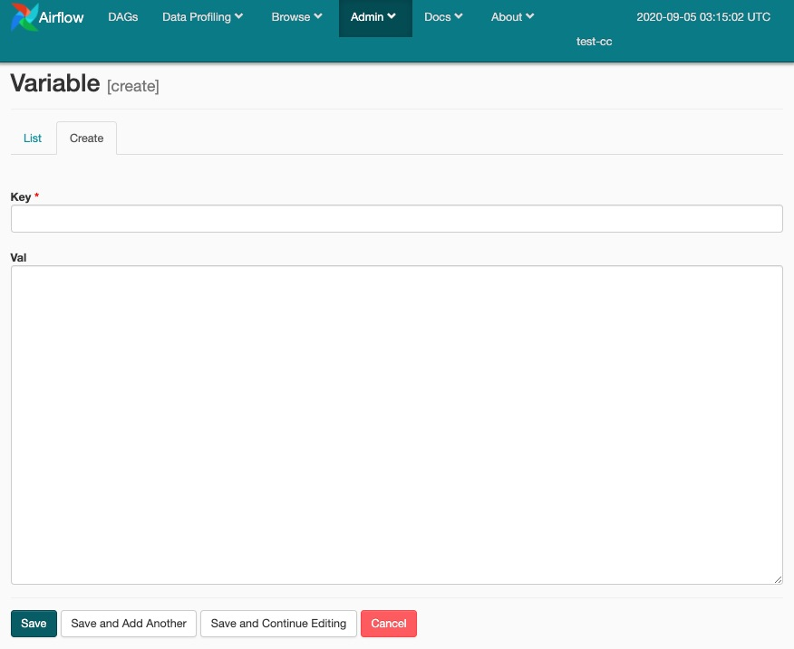

This is an example of running a Spark application from Cloud Composer. Composer creates a DataProc cluster and runs the spark application in the cluster and after completion deletes the DataProc Cluster.
While creating a cluster, the composer uses the autocating policies. See the step below for creating scaling properties. Create a cloud composer environment. You can follow the steps described
[here](https://cloud.google.com/composer/docs/how-to/managing/creating#gcloud).

## Creating scaling policy

The following YAML example defines a policy that specifies all required fields. It also provides maxInstances values for both primary and secondary (preemptible) workers, and also specifies a 4-minute cooldownPeriod (the default is 2 minutes).

```
workerConfig:
  minInstances: 2
  maxInstances: 100
secondaryWorkerConfig:
  maxInstances: 50
basicAlgorithm:
  cooldownPeriod: 4m
  yarnConfig:
    scaleUpFactor: 0.05
    scaleDownFactor: 1.0
    gracefulDecommissionTimeout: 1h
```

```
gcloud dataproc autoscaling-policies import ephimeral-scaling-policy --source=scaling.yml --region=us-central1
```

### Creating Composer environment variables and Airflow variables

When you create or update an environment, you can add environment variables, which Cloud Composer provides to the Apache Airflow scheduler, worker, and web server processes. The following command shows an example of creating variables for composer bucket and processing project.
Below is a screenshot showing  (deleted project names and Datafolder) the composer environment name, location, and composer bucket.


```
export COMPOSER_ENV_NAME=dev-pipeline-orchestrator
export LOCATION=us-central1
export COMPOSER_BUCKET=[[Bucket]]
export PROJECT_ID=[[Project_Id]]
gcloud composer environments update $COMPOSER_ENV_NAME \
  --location $LOCATION \
  --update-env-variables=COMPOSER_BUCKET=$COMPOSER_BUCKET,PROJECT_ID=$PROJECT_ID
```

Similarly, the following shows the process of creating the airflow variables. For example, the command below creates an airflow variable `NUM_SAMPLES`.

```
gcloud composer environments run $COMPOSER_ENV_NAME --location $LOCATION variables -- --set NUM_SAMPLES 10
```

You can also set the variable and its default value through Airflow UI as shown below.




## Run Spark Application through Cloud Composer  

Copy Spark Application code

```
export PIPELINE_NAME=compute-pi-pipeline
gsutil cp dataproc/calculate-pi.py gs://$COMPOSER_BUCKET/data/$PIPELINE_NAME/
```


Copy DAG application

```
gsutil cp dags/calculate-pi.py gs://$COMPOSER_BUCKET/data/$PIPELINE_NAME/
```

The DAG (Graph view) is shown below.

!(DAG Graph View)[./docs/graph_view.jpg]